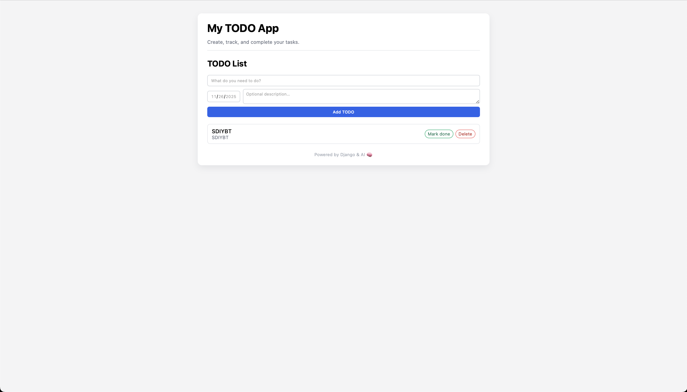

# Django TODO App – AI Dev Tools Zoomcamp HW1

This is a simple TODO application built with **Django**, as part of the **AI Dev Tools Zoomcamp (2025)** homework on AI-assisted development.

The goal of the assignment was to build a full CRUD TODO app using an AI assistant (ChatGPT) *without needing prior Django experience*.



---

## Features

- Create TODO items with:
  - Title (required)
  - Optional description
  - Optional due date
- View a list of all TODOs
- Mark TODOs as **done / not done**
- Delete TODOs
- Basic, clean UI using HTML + inline CSS (no extra frontend framework)

---

## Tech Stack

- Python 3.12 (local)
- Django 5.x
- SQLite (default Django DB)

---

## Project Structure

Inside this repo, the project for HW1 lives in the `01-todo` folder:

```text
01-todo/
├── manage.py
├── requirements.txt
├── todo_project/
│   ├── __init__.py
│   ├── asgi.py
│   ├── settings.py
│   ├── urls.py
│   └── wsgi.py
├── todos/
│   ├── __init__.py
│   ├── admin.py
│   ├── apps.py
│   ├── migrations/
│   ├── models.py
│   ├── tests.py
│   └── views.py
└── templates/
    ├── base.html
    └── home.html
```

The virtual environment (venv/) and local SQLite DB (db.sqlite3) are excluded via .gitignore.

1. Clone the repo and go to the project folder
```
git clone https://github.com/<your-username>/ai-dev-tools-zoomcamp.git
cd ai-dev-tools-zoomcamp/01-todo
```

2. Create and activate a virtual environment
```
python -m venv venv
source venv/bin/activate          # macOS / Linux
# venv\Scripts\activate           # Windows
```

3. Install dependencies
```
pip install -r requirements.txt
```

4. Apply migrations
```
python manage.py migrate
```

5. Running the App
Start the Django development server:
```
python manage.py runserver
```

Then open your browser at:
	•	http://127.0.0.1:8000/  or
	•	http://localhost:8000/

You’ll see:
	•	A form to create TODO items
	•	A list of existing TODOs
	•	Buttons to mark them done / not done and delete them

Running Tests
The app uses Django’s built-in test runner.
To run tests:
```
python manage.py test
```

How AI Was Used

This project was intentionally built with AI assistance as part of the homework:
	-	Setting up the Django project & app (startproject, startapp)
	-	Designing the Todo model and migrations
	-	Implementing views for:
	-	Listing and creating TODOs
	-	Toggling completion status
	-	Deleting items
	-	(Optional) editing items
	-	Wiring URLs and templates
	-	Debugging common Django errors (missing views, URL issues, migration errors)
	-	Designing a simple but clean HTML/CSS layout for the TODO UI
	-	Writing this README.md and requirements.txt

All code was reviewed and understood by me as part of the learning process.

License

This project is for educational purposes as part of the AI Dev Tools Zoomcamp (2025). Feel free to reuse or extend it for your own learning.
